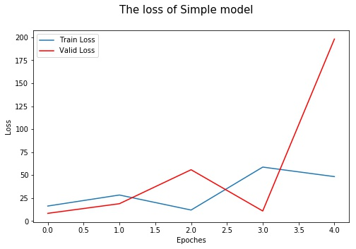
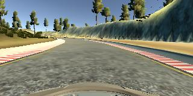
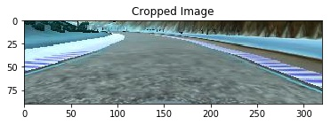
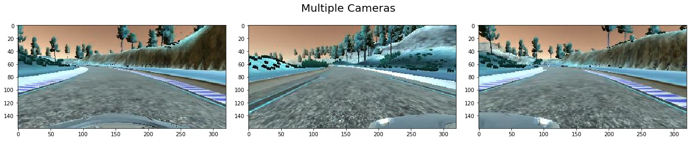

# Behavioral Cloning Project

### My project includes the following files:

    * CarND-Behavioral-Cloning-P3/data_generator.py containing the script to create a generator which pull pieces of training data.
    * CarND-Behavioral-Cloning-P3/samples_model.py containing the script to create the model.
    * CarND-Behavioral-Cloning-P3/train_utils.py containing the script to train the model.
    * CarND-Behavioral-Cloning-P3/drive.py for driving the car in autonomous mode.
    * CarND-Behavioral-Cloning-P3/model.h5, model_lenet.h5, model_nvidia.h5, model_nvidia1.h5 containing a trained convolution neural network.
    * writeup_report.md summarizing the results.
    * run7.mp4 Recording Video in Autonomous Mode.
    * results save visualization images.

### Functional code:

**1. Training model:using Workspace Terminal to train model .**   
`python /home/workspace/CarND-Behavioral-Cloning-P3/train_utils.py`

**2. Using the Udacity provided simulator and drive.py file, the car can be driven autonomously around the track by executing**  
`python /home/workspace/CarND-Behavioral-Cloning-P3/drive.py /home/workspace/CarND-Behavioral-Cloning-P3/model_nvidia1.h5 run7`  

**3. Creates a video based on images found in the run7 directory.**  
`python video.py run7 --fps 48`

###  Model Architecture and Training Strategy:  

 **Tips:**The project of the Behavioral Cloning is a regression problem by fitting the input image and the output steering angle of the vehicle.

 **1. Solution Design Approach**

The overall strategy for deriving a model architecture was to extract the feature of the images and to fit the relationship of the steering angle of the vehicle.

My frist step was to use a sample model to train; But the sample model had a high mean squared error on the training set which implied that the model was underfitting.

The second step was to use a convolution neural network model LeNet; I thought this model might be appropriate because the LeNet model can extract features from images very well.

In order to gauge how well the model was working, I split my image and steering angle data into a training and validation set. Both the training set and the validation set had a low mean squared . So I run the simulator to see how well the car was driving around track one. Well， The car fell off the track at the turning.

To improve the driving behavior ，I used a more robust model which INVIDIA's model for actual self_driving car.

There were a few spots where the vehicle fell off the track. to improve the driving behavior in these cases, I used more data.

At the end of the process, the vehicle is able to drive autonomously around the track without leaving the road.

**2. Final Model Architecture**

The final model NVIDIA model architecture (samples_models.py lines 36-54) consisted of a convolution neural network with the following layers and layer sizes.

Here is a teble of the architecture:

| Layer                            | Description          |
 | :--------                         |:-----------          |
 | Input       |  Normalization and mean centering data input_shape=(160, 320, 3)       |
 | Cropping2D    |  cropping=((50, 20),(0, 0))  Remove the head 50px and the bottom 20px of the images.                                 |
 | Convolution2D  | output_dim = 24, filter=(5,5), subsample=(2,2), activation='relu'      |
 | Convolution2D  | output_dim = 36, filter=(5,5), subsample=(2,2), activation='relu'      |
 | Convolution2D | output_dim = 48, filter=(5,5), subsample=(2,2), activation='relu'       |
 | Convolution2D  | output_dim = 64,  filter=(3,3),activation='relu'                 |
 | Convolution2D  | output_dim = 64,  filter=(3,3),activation='relu'     |
 | Flatten   |       |
 | Dense| output_dim=100      |
 | Dense      |   output_dim=50                                    |
 | Dense       | output_dim=10                                    |
 |Dense   |  output_dim=1        |

**3. Training strategy**

We know that this project is a machine learning regression problem; the key point is to extract the lane features in the images and to establish the correlation with the steering angle of the car.

The process of extracting features is divided into two stages: collecting data and data preprocessing.

| Stage I:  Collecting data     | Stage II: Data preprocessing  |
| :--------                | :-----------          |
| track 1 driving forward       |  Normalization        |
| track 1 Reverse driving       |  Cropping image    |
| track 2 driving forward       |  Multiple Cameras      |
| track 2 Reverse driving       | Data Augmentation for flipping images     |

To capture good driving behavior, I first recorded one laps on track one using center lane driving. Here is an example image of center lane driving:

The normalization and the cropping image was used to processing the images. Final the car drive leaving the road to the left.

The reason for this result is that most of the lanes turn left in Lane 1.To solve this problem, I used data augmentation to flipping the images. For example, here is an image that has then been flipped:

Final the car goes farther than last time. But the car drive leaving the road to the right this time.

I then recorded the vehicle recovering from the right side of the road back to center So that the car can return to the center from right driving behavior.

After the collection process, I had 3137 number of data points. I then preprocessed this data by 3 steps:

**Step1: Flipping Images And Steering Measurements. So the number of data points is 6274. (data_generator.py lines 49-53)**  
**Step2: Normalization the data and mean centering the data.(samples_models.py line 40)**  
**Step3: Cropping images.(samples_models.py line 41)**

At the end of the process, the vehicle is able to drive autonomously around the track without leaving the road.

The run7.mp4 recording my vehicle driving autonomously around the track 1.

The GPU time on my workspace is less than 4 hours, So I did't train more data.
